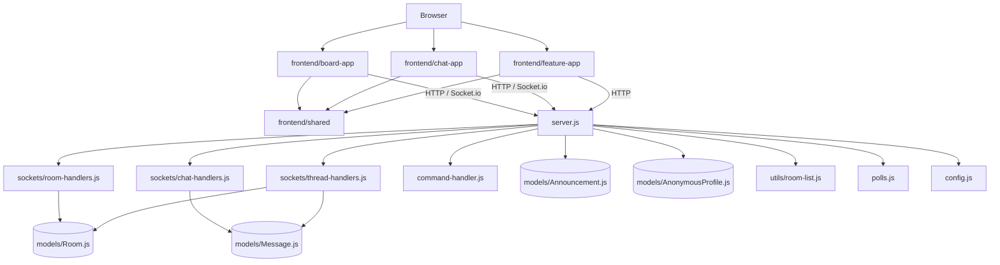

# Baha - Anonymous Text Chat Forum 💬

*🌍 Read this in other languages: [English](README.en.md), [繁體中文](README.md).*
---

Baha is a real-time anonymous text chat platform built with Node.js and Socket.io. Users can freely create topic rooms, communicate instantly, and enjoy interactive features like Danmaku (bullet curtain) mode.

[👉 Click here to see supported Markdown commands](#-supported-markdown-formatting-commands)

## ✨ Core Features

- **Completely Anonymous**: The system automatically assigns a random short ID (8~10 characters) to each connected user, and generates an exclusive fixed display color for each ID via a hash algorithm; the ID is stored in the browser’s localStorage so it survives page reloads and short reconnects until cache is cleared. The feature center can also copy or import the same anonymous key so you can keep the same identity across devices.
- **Multi-language Support (i18n)**: Automatically detects browser language, providing Traditional Chinese, Simplified Chinese, English, Japanese, Korean, and Vietnamese interfaces.
- **PWA Desktop Installation**: Perfectly adapts to mobile notches and bottom safe areas. Supports direct installation to mobile and desktop home screens for a native app-like fullscreen experience.
- **Dynamic Topic Lobby**:
  - Freely create new topic rooms.
  - **Password Protected Rooms**: Enter `/lock [password] [room_name]` in the lobby to create a private room with a 🔒 icon. Passwords are securely hashed using bcrypt.
  - Real-time display of "online user count" and "creation time" for each room.
  - Supports real-time keyword search and filtering for topics. You can use the following commands in the search box:
    - `/hot`: Sort rooms by online user count.
    - `/lock`: Show only password-protected rooms.
    - `/open`: Show only public rooms.
- **Smooth Real-time Chat**:
  - Distinguishes between "self" and "others" message bubbles (similar to LINE/Messenger UI).
  - Includes precise timestamps.
  - **Interactive Menu & Reply**: Right-click (PC) or long-press (Mobile) a message to open a menu to "↩️ Reply" or copy text.
  - Supports lightweight Discord-like Markdown formatting (bold, code blocks, spoilers, etc.).
- **Multimedia & Link Previews**:
  - Automatically converts image, video (mp4/webm/mov), and audio (mp3/wav/ogg) URLs into built-in players within the chat box.
  - Seamless YouTube video embedding.
  - Automatically fetches titles, descriptions, and thumbnails of general web pages to generate beautiful visual preview cards.
  - Recognizes Google Drive URLs and converts them into clear one-click download buttons.
- **🚀 Danmaku Mode**: When the message frequency in a room is too high (over 10 msgs/sec), the system automatically activates Danmaku mode. Messages will fly across the screen from right to left, preventing the chat from scrolling too fast to read.
- **Data Persistence**: Integrated with MongoDB cloud database. Topic lists and the latest 50 chat records are safely stored even if the server restarts or sleeps.
- **Room hosts & admin controls**: Room ownership is tied directly to the anonymous identity that created the room. As long as you keep the same anonymous key in `localStorage`, or import that same key on another device, you can continue using room management commands like `/rename`, `/public`, `/private`, `/clear`, `/delete`, `/ban`, `/kick`, `/mute`, and `/announce` without any separate admin login flow.
- **Server Load Alerts**: The backend continuously checks memory usage, Node heap pressure, and CPU load. When the Render server stays under heavy pressure for consecutive checks, it automatically emails the administrator without relying on a fixed online-user threshold.
- **Graceful Reconnection**: Provides a fullscreen loading/reconnection overlay when the server sleeps or network disconnects, optimizing user experience.

## 🛠️ Tech Stack

- **Frontend**: React 19, Vite, CSS3
- **Frontend apps**:
  - `frontend/board-app`: main board / topic lobby
  - `frontend/chat-app`: chat room / threads / room-host controls
  - `frontend/feature-app`: feature center / announcements / anonymous identity / sponsorship
  - `frontend/shared`: shared anonymous identity helpers and common front-end utilities
- **Backend**: Node.js, Express.js
- **Real-time**: Socket.io
- **Database**: MongoDB, Mongoose (Cloud hosted on MongoDB Atlas)
- **Email Service**: Nodemailer

## 🧱 Project Architecture

This project can now be viewed in four layers:

1. **React frontend layer**: Three independent frontends for the board lobby, chat room, and feature center.
2. **Express routing layer**: Serves static assets, React builds, and version/meta endpoints.
3. **Socket event layer**: Handles room creation, chat, threads, commands, and state sync.
4. **Data & utility layer**: Handles models, room sorting, anonymous profiles, polls, and shared config.



### Module Responsibility Table

| Module | Responsibility | Notes |
|---|---|---|
| [server.js](server.js) | Server entry | Starts Express / Socket.io, connects the database, and registers socket handlers |
| [frontend/board-app](frontend/board-app) | Main board | Provides room creation, topic search, hot rooms, draggable whiteboard widgets, and custom modules |
| [frontend/chat-app](frontend/chat-app) | Chat room | Provides room chat, replies, threads, polls, and room-host controls |
| [frontend/feature-app](frontend/feature-app) | Feature center | Provides anonymous identity, command guides, embed guides, announcements, server status, and sponsorship info |
| [frontend/shared](frontend/shared) | Shared frontend layer | Stores shared anonymous identity / anonymous key logic and common helpers |
| [sockets/room-handlers.js](sockets/room-handlers.js) | Room management | Handles create/join/leave/password validation and room list updates |
| [sockets/chat-handlers.js](sockets/chat-handlers.js) | Chat flow | Handles sending messages, typing, polls, and chat-related state sync |
| [sockets/thread-handlers.js](sockets/thread-handlers.js) | Threads | Handles child thread creation, parent message markers, and thread links |
| [commands/](commands) | Slash commands | Folder for management and interaction command implementations |
| [command-handler.js](command-handler.js) | Command router | Parses `/xxx` input and dispatches to the correct command |
| [models/Room.js](models/Room.js) | Room data | Stores room names, display names, passwords, creator identity, thread relations, and bans |
| [models/Message.js](models/Message.js) | Message data | Stores chat content, replies, thread state, link previews, and timestamps |
| [models/Announcement.js](models/Announcement.js) | Announcement data | Stores system announcements |
| [models/AnonymousProfile.js](models/AnonymousProfile.js) | Anonymous identity data | Stores anonymous display names so the same anonymous key can be reused across devices |
| [utils/room-list.js](utils/room-list.js) | Room list | Sorts rooms and formats online counts |
| [polls.js](polls.js) | Poll engine | Manages poll data and vote calculation |
| [config.js](config.js) | Shared config | Stores shared constants such as history message limits |

### Architecture Notes

- This project is no longer just a chat room; it now combines anonymous chat, a whiteboard-style topic lobby, and a dedicated feature center.
- The main entry now lands on the React board lobby (`/react-board/`), while the chat room and feature center each have their own React routes.
- The frontend handles rendering and interactions, while the backend handles state and data; chat rooms, rooms, and threads still sync in real time over Socket.io.
- The current split is much easier to maintain because the main site, chat, feature center, rooms, threads, commands, and polls now have clearer module boundaries.

## 📝 Supported Markdown Formatting Commands

Note that the client renders Markdown via `markdown-it` and sanitizes the resulting HTML with `DOMPurify`, so you can use heading, code, spoiler, and other Discord-style formatting safely right in the chat input.

The Markdown stack now layers on three plugin families:
1. **Interaction helpers** – `markdown-it-anchor` adds permalink anchors for H1~H3, `markdown-it-abbr` surfaces tooltip definitions for jargon, and `markdown-it-container` powers `::: warning ... :::`-style callouts.
2. **Media & layout** – `markdown-it-video` auto-embeds YouTube/Vimeo/Vine, `markdown-it-sub`/`markdown-it-sup` support subscripts/superscripts, and `markdown-it-multimd-table` unlocks rowspan/colspan-powered tables.
3. **Developer polish** – `markdown-it-highlightjs` paired with highlight.js gives beautiful syntax coloring for shared code blocks.

| Effect | Syntax | Example |
| :--- | :--- | :--- |
| Heading 1 | `# text` | `# Main Heading` |
| Heading 2 | `## text` | `## Sub Heading` |
| Heading 3 | `### text` | `### Small Heading` |
| **Bold** | `**text**` | `**This is bold**` |
| *Italic* | `*text*` | `*This is italic*` |
| <u>Underline</u> | `__text__` | `__This is underline__` |
| <del>Strikethrough</del> | `~~text~~` | `~~This is strikethrough~~` |
| Blockquote | `> text` | `> This is a quote` |
| Spoiler (Click to reveal) | `\|\|text\|\|` | `\|\|The butler did it\|\|` |
| Inline Code | \`code\` | \`console.log()\` |
| Code Block | \`\`\`<br>code<br>\`\`\` | \`\`\`<br>let a = 1;<br>\`\`\` |
| Toggle Markdown | `/md` | Type `/md` to enable or disable formatting |
| Encrypted Message | `[lock:password]text[/lock]` | `[lock:1234]secret[/lock]` |

## 🎉 Interactive Effects & Utility Commands

- `/canvas`: Automatically generate a dedicated Excalidraw real-time canvas URL to draw together!
- `/roll [text]`: Roll a random number from 1 to 100, great for drawing lots or comparing sizes!
- `/party [text]`: Fullscreen confetti explosion, perfect for celebrations or welcoming!
- `/quake [text]`: Fullscreen severe shaking, great for expressing shock or excitement!
- `/poll <question> | <option1> | <option2> [...]`: Start a poll inside the room, which renders a live vote card; everyone’s clicks immediately update the counts.
- `/kick <ID>`: Admins can expel a specific anonymous ID from the room.
- `/mute <ID>`: Admins can silence an ID so they cannot send messages while still seeing the chat.
- `typing indicator`: The chat footer shows who is typing (by their anonymous ID) so everyone knows when someone is composing a message.

## 🧵 Threads

If a message spawns a whirlwind of replies, right-click it (or long-press on mobile) and choose “🧵 Start thread.” Pick a title, and the server will post a system message in the main room with a “Open thread” button; clicking it takes everyone into a dedicated sub-room that always knows which parent room it came from and lets you return with a single tap. Threads keep the main conversation tidy without silencing popular topics.

## ⚠️ Duplicate room names

When you create a new room, the client now immediately warns you if the name is already taken so you can pick a unique identifier instead of silently failing.

## 🛡️ Room Host & Admin Commands

Room ownership now follows the anonymous identity that created the room. If the same anonymous key remains in `localStorage`, or you import that key on another device, you keep the same room-host privileges without a separate login or recovery code.

Once you are an admin for a room you can maintain it with:

- `/rename <new name>`: Update the room’s display title as shown in the lobby and chat header.
- `/public`: Remove the password so anyone can join immediately.
- `/private <password>`: Lock the room behind a secure password.
- `/clear`: Purge the current room’s message history from the database.
- `/delete`: Close the room entirely (except the default lobby) and force everyone back to the main hall.
- `/ban <ID>`: Ban and kick a specific anonymous ID so it cannot rejoin.
- `/kick <ID>`: Kick someone without blocking future re-entry.
- `/mute <ID> [minutes]`: Temporarily silence a misbehaving ID (default 5 minutes, 1–60 minutes supported).
- `/announce <title> | <content>`: Broadcast a system announcement to every connected user.

Each command triggers a room list refresh and system message so the lobby and participants stay in sync.

## 💝 Support Baha

If you enjoy this anonymous room, you can keep it alive through:

- Email `pudding050@gmail.com` and mention your sponsorship intent so I can respond and log it.
- PayPal “Love Support” NT$30 → [https://www.paypal.com/ncp/payment/VADFCCNV65CQQ](https://www.paypal.com/ncp/payment/VADFCCNV65CQQ)

Every contribution helps keep the project stable—thanks for being here 💕

## 🧠 PWA Cache Tips

Because the app ships with a Service Worker, browsers can sometimes keep showing an older version. In addition to forcing a hard refresh, an update banner now appears when a new Service Worker finishes installing so you can reload once it’s ready instead of clearing browser caches manually. When you change front-end assets, bump the `CACHE_NAME` string inside `public/sw.js` before deployment; the combination of cache-busting plus the banner ensures visitors always pull the latest bundle.

## 🚀 Local Installation & Execution

```bash
git clone https://github.com/YourAccount/baha-chat.git
cd baha-chat
npm install
npm start
```
Open `http://localhost:3000` in your browser.
