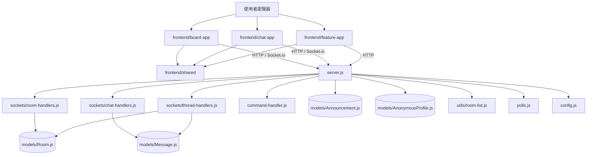

# Baha - 匿名文字聊天論壇 💬

*🌍 Read this in other languages: [English](README.en.md), [繁體中文](README.md).*
---

Baha 是一個基於 Node.js 與 Socket.io 打造的即時匿名文字聊天平台。使用者可以自由建立話題房間、即時交流，並具備彈幕模式等趣味互動功能。

[👉 點擊這裡查看聊天室支援的 Markdown 語法指令](#-支援的-markdown-格式指令)

## ✨ 核心功能

- **完全匿名機制**：系統自動為每位連線使用者配發隨機短 ID (8~10 碼)，並透過雜湊演算法為每個 ID 生成專屬且固定的顯示顏色；這個 ID 會存在瀏覽器的 `localStorage`，即使重新整理頁面或短暫斷線，ID 會保留直到使用者清除快取；功能中心也能複製或匯入同一把匿名金鑰，讓你在不同裝置延續同一個匿名身份。
- **多國語言支援 (i18n)**：自動偵測瀏覽器語言，提供繁體中文、簡體中文、英文、日文、韓文與越南文介面。
- **PWA 桌面安裝**：完美適配手機瀏海與底部安全區域，支援直接安裝至手機與電腦桌面，享受如原生 App 般的無邊框全螢幕體驗。
- **動態話題大廳**：
  - 自由建立新話題房間。
  - **密碼保護房**：在大廳輸入 `/lock [密碼] [房間名稱]` 即可建立帶有 🔒 圖示的專屬房間。
  - 實時顯示各房間的「線上人數」與「建立時間」。
  - 支援關鍵字即時搜尋篩選話題。在搜尋框可使用以下指令：
    - `/hot`：依據線上人數多寡排序。
    - `/lock`：僅顯示密碼保護房。
    - `/open`：僅顯示公開房間。
- **即時順暢聊天**：
  - 區分「自己」與「他人」的訊息氣泡（類似 LINE/Messenger 介面）。
  - 附帶精確的發送時間戳記。
  - **互動選單與回覆**：電腦版右鍵、手機版長按訊息，可叫出選單來「↩️ 回覆」特定訊息或複製文字。
  - 支援類似 Discord 的輕量級 Markdown 格式化（粗體、代碼塊、防雷線等）。
- **多媒體與網址預覽**：
  - 自動將圖片、影片 (mp4/webm/mov)、音頻 (mp3/wav/ogg) 網址轉換為對話框內的內建播放器。
  - 支援 YouTube 影片無縫嵌入播放。
  - 自動抓取一般網頁的標題、描述與縮圖，生成精美的視覺化預覽卡片。
  - 辨識 Google Drive 網址並轉換為明顯的一鍵下載按鈕。
- **🚀 彈幕模式 (Danmaku)**：當房間內訊息發送頻率過高（超過 10 則/秒）時，系統會自動啟動彈幕模式，訊息將由右至左飛過螢幕，避免傳統對話框捲動過快無法閱讀。
- **資料持久化**：串接 MongoDB 雲端資料庫，即使伺服器重啟或休眠，話題列表與最近 50 筆聊天紀錄依然會安全保存。
- **房間管理者與角色權限**：房主身份直接綁定建立房間時使用的匿名身份，不再需要額外的管理金鑰或登入流程；只要瀏覽器保留同一把匿名金鑰，或在新裝置匯入同一把匿名金鑰，就能繼續使用 `/rename`, `/public`, `/private`, `/clear`, `/delete`, `/ban`, `/kick`, `/mute`, `/announce` 等管理指令。這種模型讓匿名使用者也能合理地維護秩序，不需要公開真實身份。
- **伺服器負載警報**：後端會持續偵測伺服器的記憶體、Node heap 與 CPU load 狀態；當 Render 伺服器連續出現高壓狀況時，會自動發送 Email 提醒管理員注意負載，而不需要再手動調整固定人數門檻。
- **優雅的重連機制**：當遇到伺服器休眠或網路斷線時，提供全螢幕的等候/重連遮罩，優化使用者體驗。

## 🛠️ 技術架構

- **前端 (Frontend)**：React 19、Vite、CSS3
- **前端子應用**：
  - `frontend/board-app`：主站白板 / 話題大廳
  - `frontend/chat-app`：聊天室 / 討論串 / 房主管理
  - `frontend/feature-app`：功能中心 / 公告 / 匿名身份與贊助
  - `frontend/shared`：匿名身份與共用前端工具
- **後端 (Backend)**：Node.js, Express.js
- **即時通訊 (Real-time)**：Socket.io
- **資料庫 (Database)**：MongoDB, Mongoose (雲端代管於 MongoDB Atlas)
- **郵件發送**：Nodemailer

## 🧱 專案架構

這個專案現在可以分成四個主要層次：

1. **React 前端層**：主站白板、聊天室、功能中心三個獨立前端。
2. **Express 路由層**：負責靜態檔案、React build 路由與版本資訊。
3. **Socket 事件層**：負責建立房間、聊天、討論串、指令與狀態同步。
4. **資料與工具層**：負責資料模型、房間排序、匿名身份、投票與共用設定。



### 模組職責表

| 模組 | 職責 | 說明 |
|---|---|---|
| [server.js](server.js) | 伺服器入口 | 負責啟動 Express / Socket.io、連線資料庫、註冊各種 socket handler |
| [frontend/board-app](frontend/board-app) | 主站白板 | 提供建立房間、搜尋話題、熱門房間、拖曳白板與自訂模組 |
| [frontend/chat-app](frontend/chat-app) | 聊天室 | 提供房間聊天、回覆、討論串、投票與房主管理 |
| [frontend/feature-app](frontend/feature-app) | 功能中心 | 提供匿名身份、指令教學、嵌入教學、公告、伺服器狀態與贊助資訊 |
| [frontend/shared](frontend/shared) | 前端共用層 | 儲存匿名身份 / 匿名金鑰等共用前端邏輯 |
| [sockets/room-handlers.js](sockets/room-handlers.js) | 房間管理 | 處理建立、加入、離開、密碼驗證與房間列表更新 |
| [sockets/chat-handlers.js](sockets/chat-handlers.js) | 聊天流程 | 處理訊息發送、typing、投票與聊天相關狀態同步 |
| [sockets/thread-handlers.js](sockets/thread-handlers.js) | 討論串 | 處理子討論串建立、父訊息標記與 thread 連結 |
| [commands/](commands) | 斜線指令 | 各種管理與互動指令的實作目錄 |
| [command-handler.js](command-handler.js) | 指令分派 | 統一解析 `/xxx` 輸入並導向對應指令 |
| [models/Room.js](models/Room.js) | 房間資料 | 儲存房間名稱、顯示名、密碼、建立者、thread 關聯與黑名單 |
| [models/Message.js](models/Message.js) | 訊息資料 | 儲存聊天內容、回覆、thread 狀態、連結預覽與時間戳記 |
| [models/Announcement.js](models/Announcement.js) | 公告資料 | 儲存系統公告內容 |
| [models/AnonymousProfile.js](models/AnonymousProfile.js) | 匿名身份資料 | 儲存匿名名稱，並讓不同裝置可沿用同一把匿名金鑰 |
| [utils/room-list.js](utils/room-list.js) | 房間列表 | 整理房間排序與線上人數顯示 |
| [polls.js](polls.js) | 投票功能 | 管理投票資料與投票計算 |
| [config.js](config.js) | 共用設定 | 儲存歷史訊息數量等共用常數 |

### 架構理解

- 這個專案已經不是單純聊天室，而是「匿名聊天室 + 白板式話題大廳 + 功能中心」的混合應用。
- 現在主站入口會先進入 React 白板大廳 (`/react-board/`)，聊天室與功能中心也各自有獨立 React 路由。
- 前端負責畫面與互動，後端負責狀態與資料，聊天室 / 房間 / 討論串仍透過 Socket.io 即時同步。
- 目前的資料拆分方式已經很適合後續維護，因為主站、聊天室、功能中心、房間、討論串、指令與投票都已經有相對清楚的模組邊界。

## 📝 支援的 Markdown 格式指令

在聊天輸入框中，你可以使用以下語法來排版你的訊息，發送後會自動渲染出對應效果：

> 💡 技術提示：前端使用 `markdown-it` 解析語法並搭配 `DOMPurify` 進行清理，確保所有顯示內容既豐富又安全，支援 Discord 風格的表情符號、程式碼區塊與標題等。

> 📌 現在也支援 Emoji、註腳、任務清單、標記與插入標籤，讓你貼近 GitHub/Discord 的 Markdown 體驗。

> 🧰 進階插件分三大類：
> 1. **聊天互動強化**：`markdown-it-anchor` 為 H1~H3 產生錨點，`markdown-it-abbr` 可設定術語縮寫悬浮解釋，`markdown-it-container` 則支援 `::: warning ... :::` 這類自訂資訊框。
> 2. **多媒體與排版進階**：`markdown-it-video` 自動將 YouTube/Vimeo 連結轉成播放器，`markdown-it-sub/sup` 支援下標與上標，`markdown-it-multimd-table` 提供 rowspan/colspan 等強化表格。
> 3. **開發者友善**：`markdown-it-highlightjs` 搭配 highlight.js，讓程式碼區塊自動上色，分享技術貼文更專業。

| 效果 | 輸入語法 | 範例 |
| :--- | :--- | :--- |
| 一級標題 | `# 文字` | `# 這是標題` |
| 二級標題 | `## 文字` | `## 這是副標題` |
| 三級標題 | `### 文字` | `### 這是小標題` |
| **粗體** | `**文字**` | `**這是粗體**` |
| *斜體* | `*文字*` | `*這是斜體*` |
| <u>底線</u> | `__文字__` | `__這是底線__` |
| <del>刪除線</del> | `~~文字~~` | `~~這是刪除線~~` |
| 引用文字 | `> 文字` | `> 這是一段引用` |
| 防雷/劇透 (點擊顯示) | `\|\|文字\|\|` | `\|\|兇手是他\|\|` |
| 單行程式碼 | \`單行程式碼\` | \`console.log()\` |
| 多行程式碼區塊 | \`\`\`<br>多行程式碼<br>\`\`\` | \`\`\`<br>let a = 1;<br>\`\`\` |
| 切換 Markdown | `/md` | 輸入 `/md` 可開啟或關閉格式化 |
| 加密訊息 (需密碼解鎖) | `[lock:密碼]文字[/lock]` | `[lock:1234]秘密[/lock]` |

## 🎉 互動特效與實用指令

在聊天室輸入以下指令，可以觸發特殊功能或全螢幕特效：

- `/canvas`：自動產生一個專屬的 Excalidraw 多人即時畫布網址，邀請大家一起畫畫！
- `/roll [文字]`：擲出 1~100 的隨機數字，適合用來抽籤或比大小！
- `/party [文字]`：全螢幕噴發彩色碎紙花，適合慶祝或歡迎！
- `/quake [文字]`：全螢幕劇烈震動，適合表達震驚或激動的情緒！
- `/poll <問題> | <選項一> | <選項二> [...]`：在房間內發起投票，會顯示帶統計的投票卡片，其他人點選後即時看到票數。
- `/kick <ID>`：擁有管理權的人可以將某個匿名 ID 踢出房間。
- `/mute <ID>`：擁有管理權的人可以禁止該匿名 ID 發言，但仍能看見聊天室。
- `typing indicator`：在聊天室底部會顯示正在輸入的匿名 ID，讓大家預期下一條訊息出自誰。

## 🧵 子討論串 (Threads)

當聊天室某則訊息正在熱鬧地討論時，使用者可以在該條訊息上右鍵 / 長按，選擇「🧵 開啟討論串」來建立專屬子房間。系統會提示輸入一個討論串標題，並自動在主頻道出現一則系統訊息附上「前往討論串」按鈕，點擊即可進入新的子房間；在子房間的頁首也會顯示原始房間名稱，方便隨時返回主頻道。這個機制可以讓爆炸性的話題有自己的空間，避免洗版主頻道。

## ⚠️ 房間建立重複提醒

在大廳建立新房間時，如果名稱已經被其他房間使用，前端會立即跳出錯誤提示請你換一個名字，避免同名房間造成混亂。

## 🛡️ 房主與管理員指令

房主身份現在直接綁定建立房間時所使用的匿名身份；只要瀏覽器保留同一把匿名金鑰，或在新裝置匯入同一把匿名金鑰，就能繼續管理原本建立的房間，不需額外登入或保存另一組管理代碼。

在取得管理權後，房主可以使用以下指令維護房間秩序：

- `/rename <新名稱>`：更新本房在大廳與聊天室標題欄顯示的名稱。
- `/public`：移除密碼鎖，讓任何人都能直接加入。
- `/private <密碼>`：為房間加上一組新密碼，只有持有密碼的訪客可進入。
- `/clear`：清空 MongoDB 中該房間的所有訊息，讓聊天室重置。
- `/delete`：立即關閉並刪除該房間（綜合閒聊除外），所有人會被強制送回大廳。
- `/ban <ID>`：將某個匿名 ID 加入黑名單並踢出房間，該 ID 將無法再回來。
- `/kick <ID>`：立即踢人，但保留再次加入的能力。
- `/mute <ID> [分鐘]`：禁言該 ID（預設 5 分鐘，可指定 1~60 分鐘）。
- `/announce <標題> | <內容>`：以系統訊息方式發布全站公告。

所有這些指令皆會觸發 `room list` 更新與系統訊息，讓其他使用者可以即時感受到房間狀態的調整；`localStorage` 中的匿名身份也會在重新整理後持續保留，只要沒有清除快取，或在新裝置匯入同一把匿名金鑰，就能保持管理身分的連續性。

## 🧱 桌機白板 (Desktop Canvas)

- 桌面版 (寬度 ≥ 1200px) 會顯示一個類似微軟白板的「桌機白板」，預設包含建立房間、搜尋話題、熱門房間、常用指令與贊助資訊等模組。
- 點擊「新增組件」可把白板裡的範本拖進畫布，也可以自己撰寫標題與內文建立自訂卡片，並可任意拖曳調整位置；這些配置會儲存在瀏覽器 `localStorage` 中，下次打開依然保持你的佈局。
- 每個模組都有互動功能：在建立房間卡片中輸入後即會發送 `create room`；搜尋卡片會同步大廳搜尋框並支援 `/hot`、`/lock` 等指令；房間列表會與主列表同步呈現、可直接點擊進入；還有常用指令卡片會顯示管理與互動指令提醒。
- 需要重置佈局的時候，可以使用白板右上角的「重置佈局」按鈕將模組還原為預設，同時保留拖移與新增自訂卡片的彈性。

## 💝 支持 Baha

如果你喜歡這個匿名聊天室，歡迎使用下列方式贊助伺服器與開發成本：

- 透過 `pudding050@gmail.com` 聯絡信箱發送贊助提案，系統會自動存檔
- 支持 PayPal「愛心贊助」NT$30 → [https://www.paypal.com/ncp/payment/VADFCCNV65CQQ](https://www.paypal.com/ncp/payment/VADFCCNV65CQQ)

每份支持都讓 Baha 更穩定，感謝你的陪伴 💕

## 🚀 本地端安裝與執行

1. **複製專案**
   ```bash
   git clone https://github.com/你的帳號/baha-chat.git
   cd baha-chat
   ```

2. **安裝依賴套件**
   ```bash
   npm install
   ```

3. **設定環境變數**
   在專案根目錄建立 `.env` 檔案（如果是部署在 Render 等平台，請在後台設定這些變數）：
   ```env
   MONGODB_URI=你的_MongoDB_連線字串
   EMAIL_USER=你的_Gmail_信箱
   EMAIL_PASS=你的_Gmail_應用程式密碼
   ```
   *(註：若未設定 `MONGODB_URI`，系統將預設嘗試連線至 `mongodb://127.0.0.1:27017/baha`)*

4. **啟動伺服器**
   ```bash
   npm start
   ```
   伺服器啟動後，請在瀏覽器開啟 `http://localhost:3000` 即可開始使用。

## 📄 授權條款

本專案僅供學習與交流使用。

## 💡 常見開發提示 (Troubleshooting)

**PWA 快取問題 (畫面或功能沒有更新)**
因為本專案支援 PWA (Service Worker 離線快取)，如果在開發或部署後發現「畫面沒有更新」或「新指令沒反應」，通常是被舊快取卡住了。
- **解決方法**：在電腦上請使用「強制重新整理」按下 `Ctrl + Shift + R` (Mac: `Cmd + Shift + R`)；在手機上請至瀏覽器設定清除「網站資料」。
- **開發建議**：每次修改前端檔案 (`html`, `css`, `js`) 後，請務必去 `public/sw.js` 將 `CACHE_NAME` 的版本號 (例如 `v4` -> `v5`) 升級，強迫使用者的瀏覽器下載最新檔案。
- **進階提示**：前端會在發現新版 Service Worker 安裝完成時顯示「立即更新」的提示條，使用者點擊後就能重新整理並抓到最新版本，無需手動清除快取。
- **新版提醒**：伺服器端升級後可以先把 `public/sw.js` 的 `CACHE_NAME` 版本號往上提一次，再透過前端的提示條讓訪客按下「立即更新」即可強制換到新內容，這種雙軌機制讓開發與部署互補更穩定。
